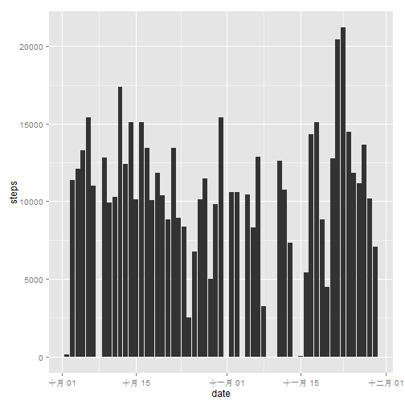
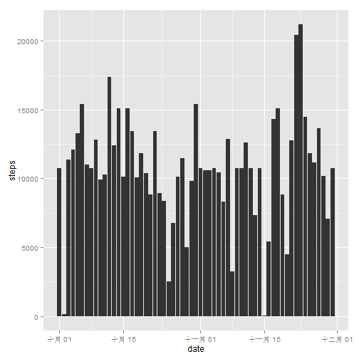
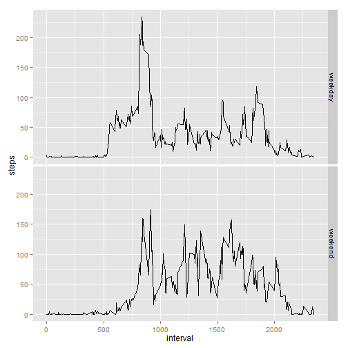

# Reroducible Research: Assessment 1


## Loading and preprocessing the data

```r
unzip("repdata-data-activity.zip")
data <- read.csv("activity.csv", stringsAsFactors = F)
data$date <- as.Date(data$date, "%Y-%m-%d")
```

## What is mean total number of steps taken per day?
1. Make a histogram of the total number of steps taken each day


```r
library(plyr)
library(ggplot2)
data_no_NA <- data[!is.na(data$steps), ]
date_steps <- ddply(data_no_NA, .(date), summarise, steps=sum(steps))
g<- ggplot(date_steps, aes(date, steps)) + geom_bar(stat = "identity")
plot(g)
```

 

2. Calculate and report the mean and median total number of steps taken per day


```r
# mean of steps
mean(date_steps$steps)
```

```
## [1] 10766
```

```r
# median of steps
median(date_steps$steps)
```

```
## [1] 10765
```

## What is the average daily activity pattern?
1. Make a time series plot (i.e. type = "l") of the 5-minute interval (x-axis) and the average number of steps taken, averaged across all days (y-axis)


```r
average_date <- ddply(data_no_NA, .(interval), summarize, steps=mean(steps))
g <- ggplot(average_date, aes(interval, steps)) + geom_line()
plot(g)
```

 

2. Which 5-minute interval, on average across all the days in the dataset, contains the maximum number of steps?


```r
average_date[average_date$steps == max(average_date$steps), ]
```

```
##     interval steps
## 104      835 206.2
```

```r
names(average_date)[2] <- "ave_steps"
```

## Imputing missing values
1. Calculate and report the total number of missing values in the dataset (i.e. the total number of rows with NAs


```r
# number of rows with NAs
sum(!complete.cases(data))
```

```
## [1] 2304
```

2. Devise a strategy for filling in all of the missing values in the dataset. The strategy does not need to be sophisticated. For example, you could use the mean/median for that day, or the mean for that 5-minute interval, etc.

> filled with the mean of for that 5-minute interval

3. Create a new dataset that is equal to the original dataset but with the missing data filled in.

## merge the average_data with data

```r
merged_data <- join(data, average_date)
```

```
## Joining by: interval
```

```r
na_index <- !complete.cases(merged_data)
merged_data$steps[na_index] <- merged_data$ave_steps[na_index]
```
4. Make a histogram of the total number of steps taken each day and Calculate and report the mean and median total number of steps taken per day. Do these values differ from the estimates from the first part of the assignment? What is the impact of imputing missing data on the estimates of the total daily number of steps?

```r
# plot the histogram
new_date_steps <- ddply(merged_data, .(date), summarize, steps=sum(steps))
g <- ggplot(new_date_steps, aes(date, steps)) + geom_bar(stat = "identity")
plot(g)
```

 

```r
# mean of steps
mean(new_date_steps$steps)
```

```
## [1] 10766
```

```r
# median of steps
median(new_date_steps$steps)
```

```
## [1] 10766
```
Mean and median total number of steps taken per day do not change much

## Are there differences in activity patterns between weekdays and weekends?


```r
day_type <- function(date) {
  if (weekdays(date) %in% c("ÐÇÆÚÁù", "ÐÇÆÚÈÕ")) {
    return ("weekend")
  } else {
    return ("weekday")
  }
}
data_no_NA$day_type <- as.factor(sapply(data_no_NA$date, day_type))
```

2. Make a panel plot containing a time series plot (i.e. type = "l") of the 5-minute interval (x-axis) and the average number of steps taken, averaged across all weekday days or weekend days (y-axis). The plot should look something like the following, which was creating using simulated data


```r
average_week <- ddply(data_no_NA, .(day_type, interval), summarize, steps=mean(steps))
g <- ggplot(average_week, aes(interval, steps))
g <- g + geom_line()
g <- g + facet_grid(day_type ~ .)
plot(g)
```

 
